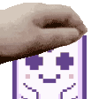

  

 

This contract act as a a proxy between user and the petting bot. Allowing for a trustless petting.

User should `setPetOperatorForAll({address of AavegotchiPetting}, true)` before using auto-petting so that it's possible to pet his aavegotchies.

### Methods and fields
- `subscribe` - subscribe user for auto-petting. Withdraws GHST fee from caller. Requires GHST of `fee` amount to be approved before calling it.
- `unsubscribe` - unsubscribes user for auto-petting and returns GHST back.
- `fee` - amount of GHST required to stake to use auto-petting.
- `claimTickets` - buy tickets for frens
- `withdrawTickets` - withdraw tickets from contract to owner
